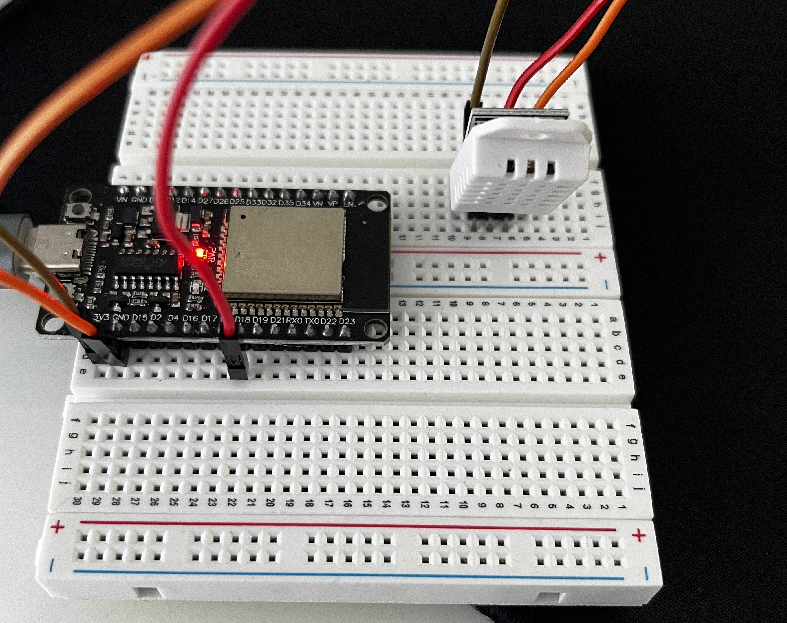

# ESP32 Weatherstation

A simple ESP32 project which reads temperature and humidity from a DHT22 sensor and displays the values via a web server on an ESP32.

## Features
- DHT22 sensor readings (temperature & humidity) 
- ESP32 web server on port 80
- Easy to adapt for other sensors

## Hardware

 
- ESP32 development board (ESP-WROOM-32)
- DHT22 sensor
- Jumper wires
- Breadboard

## Installation
- Clone the repo and paste your wifi ssid and password.
- DHT22 in PIN18
## Web Server
- After uploading, the ESP32 connects to your WiFi
- The IP adress of your esp32 webserver will appear in the serial monitor
- Open the IP in your browser (make sure your device uses 2.4 GHz WiFi and not 5GHz)
- Temperature and humidity readings are displayed
 